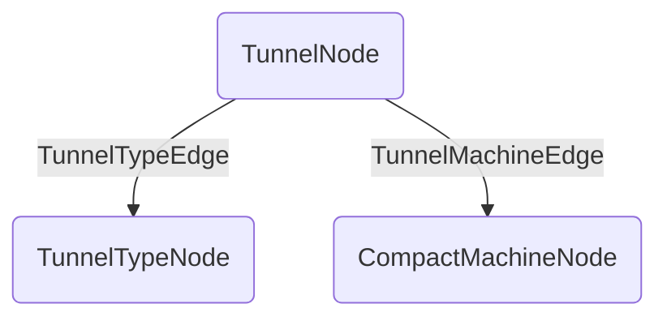

**Memory Graph Structure:**

## Room Tunnels Data File (`tunnels_chunkx_chunkz.dat`)
- graph: `CompoundTag`
  - edges: `List<IGraphEdge> | ListTag<CompoundTag>`
  - nodes: `List<IGraphNode> | ListTag<CompoundTag>`

## Nodes
The following is the general structure of a node:

| field | type | description |
| :-- | :-- | :-- |
| id | `UUID` | |
| data | `CompoundTag` | Node data, from encoding with the node's codec.

### TunnelNode

| field | type | value |
| :-- | :-- | :-- |
| type | `ResourceLocation` | compactmachines:tunnel |
| pos | `BlockPos` | |

### CompactMachineNode

| field | type | value |
| :-- | :-- | :-- |
| type | `ResourceLocation` | compactmachines:machine |
| dimension | `ResourceKey<Level>` | |
| position | `BlockPos` | |

### TunnelTypeNode

| field | type | value |
| :-- | :-- | :-- |
| type | `ResourceLocation` | compactmachines:tunnel_type |
| tunnel_type | `ResourceLocation` | |

## Edges
In addition to the edge data, stored in `data` as a `CompoundTag`, the following is stored for every edge:

| field | type | description |
| :-- | :-- | :-- |
| from | `UUID` | The UUID of the edge origin node. (U) |
| to | `UUID` | The UUID of the edge target node. (V) |
| data | `CompoundTag` | Edge data, from encoding with the edge's codec. |

### TunnelMachineEdge

| field | type | value |
| :-- | :-- | :-- |
| type | `ResourceLocation` | compactmachines:tunnel_machine |
| side | `Direction` | |

### TunnelTypeEdge

| field | type | value |
| :-- | :-- | :-- |
| type | `ResourceLocation` | compactmachines:tunnel_type |