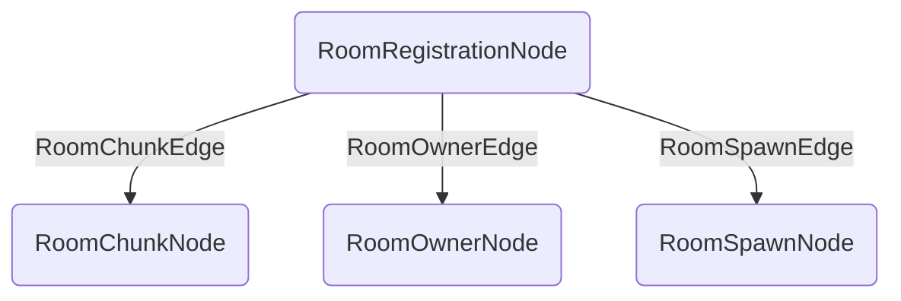
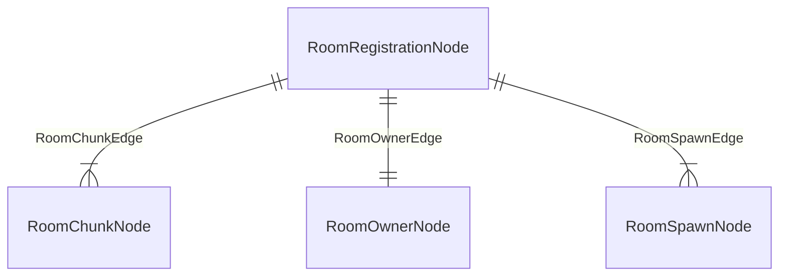

**Memory Graph Structure:**

- rooms: ListTag<CompoundTag>
  - node_id: UUID
  - name: string
  - center: Vec3
  - dimensions: Vec3i
  - default_machine_color: int

- spawns: CompoundTag
  - <room_code>: CompoundTag
    - default_spawn: CompoundTag
      - node_id: UUID
      - spawn_position: Vec3
      - spawn_rotation: Vec2
    - player_spawns: List<CompoundTag>
      - node_id: UUID
      - player_id: UUID
      - spawn_position: Vec3
      - spawn_rotation: Vec2
