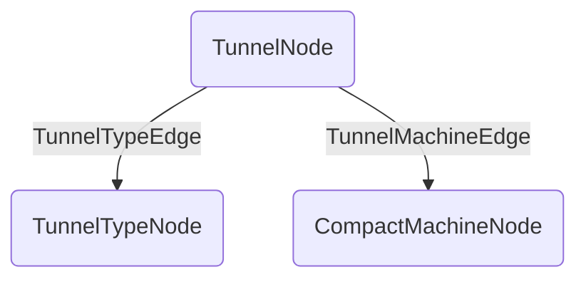

**Memory Graph Structure:**

## Room Tunnels Data File (`tunnels_roomCode.dat`)
- **version**: 3.1.0
- **nodes**: `CompoundTag`
	- **node_count**: `int`
	- **tunnels**: `List<TunnelNode> | ListTag<CompoundTag>`
	- **tunnel_types**: `List<TunnelTypeNode> | ListTag<CompoundTag>`
	- **machines**: `List<CompactMachineNode> | ListTag<CompoundTag>`
- **edges**: `CompoundTag`
	- **edge_count**: `int`
	- **machines**: `List<TunnelMachineEdge> | ListTag<CompoundTag>`
	- **tunnel_types**: `List<TunnelTypeEdge> | ListTag<CompoundTag>`

# Notable changes since 5.1
- Serialization is now moved to a dedicated class, `TunnelGraphNbtSerializer`.
- `version` is now added to the file root, specifying 3.1.0.
- `graph` has been flattened into `nodes` and `edges`.
- `node_count` and `edge_count` values have been added for validation.
- `nodes` have been flattened and no longer use a registry codec.
	- Each node type now has a constant key for its group, available from `TunnelGraphNbtKeys`.
- `edges` have been flattened and no longer use a registry codec.
	- Similar to nodes, keys can be found in `TunnelGraphNbtKeys`.
- All nodes and edges, due to no longer requiring a registry codec, have had their `type` field removed.

## Nodes
The following is the general structure of a node:

| field | type | description |
| :-- | :-- | :-- |
| id | `UUID` | |
| data | `CompoundTag` | Node data, from encoding with the node's codec.

### TunnelNode

| field | type | value |
| :-- | :-- | :-- |
| pos | `BlockPos` | |

### TunnelTypeNode

| field | type | value |
| :-- | :-- | :-- |
| tunnel_type | `ResourceKey<TunnelDefinition>` | |

### CompactMachineNode

| field | type | value |
| :-- | :-- | :-- |
| dimension | `ResourceKey<Level>` | |
| position | `BlockPos` | |

## Edges
In addition to the edge data, stored in `data` as a `CompoundTag`, the following is stored for every edge:

| field | type | description |
| :-- | :-- | :-- |
| from | `UUID` | The UUID of the edge origin node. (U) |
| to | `UUID` | The UUID of the edge target node. (V) |
| data | `CompoundTag` | Edge data, from encoding with the edge's codec. |

### TunnelMachineEdge

| field | type | value |
| :-- | :-- | :-- |
| side | `Direction` | |

### TunnelTypeEdge
(No data stored for this edge type)